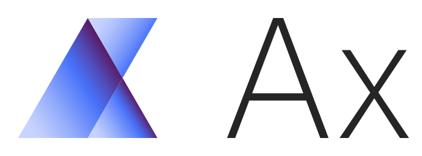

# Ax (Adaptive Experiment)

[](https://travis-ci.com/facebook/Ax)

Ax is a platform for optimizing expensive-to-evaluate configurations using machine learning and experimentation.

## Installation

### Requirements

* **Python**: you need **Python 3.6 or later** to run Ax.

At the moment, Ax does not build on Python 3.7 because of GPy (however, this is a temporary dependency).

### pip

NOTE: Both botorch and Ax are currently private repositories. This means that to download them, using `pip`, you need to make sure that you have an [SSH key is registered with GitHub](https://help.github.com/articles/generating-a-new-ssh-key-and-adding-it-to-the-ssh-agent/).

1) Install numpy and cython, if you don't have them:

```
pip3 install cython numpy
```

They are needed for parsing the `setup.py` files for both botorch and Ax.

2) Download and install botorch from the [GitHub repo](https://github.com/facebookexternal/botorch):
`pip3 install git+ssh://git@github.com/facebookexternal/botorch.git`

3) Download and install Ax from the [GitHub repo](https://github.com/facebook/Ax):
`pip3 install git+ssh://git@github.com/facebook/Ax.git`

If you are interesting in contributing to Ax, you will also need to install the
dependencies needed for development, which are listed in `DEV_REQUIRES`
in `setup.py`. You can install these directly via ssh:
`pip3 install git+ssh://git@github.com/facebook/Ax.git#egg=Ax[dev]`

Or you can clone a local version of the repo and then pip install via flags from
the root of the local repo:
`pip3 install -e .[dev]`

## Join the Ax community

See the [CONTRIBUTING](CONTRIBUTING.md) file for how to help out.

## License

Ax is licensed under the [MIT license](LICENSE.md).
