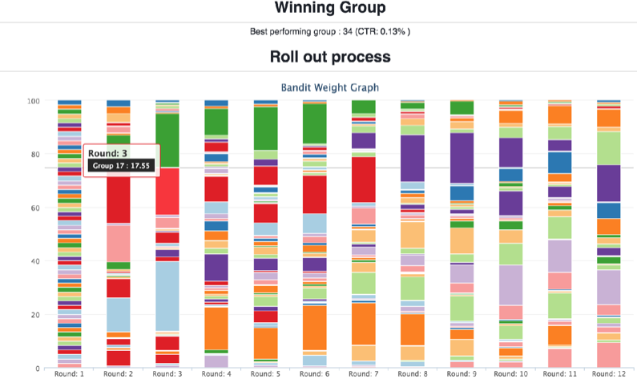

[Bayesian optimization](bayesopt.md) provides a solution for parameter tuning in spaces with continuous parameters. 
However, many decision problems begin with a fixed set of discrete candidates. 
Most ordinary A/B tests fall into this category--there are a handful of discrete choices, which are being evaluated against each other.

Bandit optimization aims to provide a smarter way of evaluating the performance of these discrete choices. 
When aiming to identify the best choice, there is an inherent tradeoff between exploration and exploitation. 
Initially, there is no information about the performance of each choice, and there is no choice but to explore, sending traffic to each choice with the sole purpose of learning more.
However, as more information comes in, the option to exploit becomes available--choosing the best performing choices thus far.
The formal goal of bandit optimization has a satisfying intuition, closely aligned with that of product users.
Over the duration of experimentation, minimize the amount of traffic/users which experience a suboptimal choice. 

Bandit algorithms accomplish this by balancing traffic between candidates with uncertainty, that have the *potential* to perform well (think high variance metric estimates), and candidates that already perform well (think high mean metric values).
This is very similar to the underlying exploration problem highlighted in the [acquisition functions](bayesopt.md#acquisition-functions) section.
Overall, bandit optimization can be thought of as a method for sequentially running experiments, that handles this tradeoff. However, rather than modeling the relationships between arms in the search space, as in Bayesian optimization, bandit optimization treats each arm as independent. As a result, bandit optimization is simpler to analyze than the model-based BayesOpt.

-----
A/B Testing
-----

In an ordinary A/B test, the relative proportion of users allocated to the test and control groups is typically fixed before beginning an experiment, and does not change throughout the duration of the experiment.
For example, experiments may be designed as follows:

**Experiment**

  *Test Group 1*: 20% of users in the experiment
  
  *Test Group 2*: 20% of users in the experiment

  *Test Group 3*: 20% of users in the experiment

  *Control Group*: 40% of users in the experiment

The test runs for a period of time, and then experimenters manually decide how to proceed. Frequently, a single high performing group may be selected for a wider launch.

-----
Bandit optimization 
-----

In contrast, bandit optimization treats the relative allocation of users as *dynamic*, changing it throughout the duration of an experiment. This enables experiments to gather data more effectively than vanilla A/B testing. 

A series of experiments in bandit optimization might look like this:

The outcome of bandit optimization can be slightly different from A/B testing. Since bandit optimization aims to optimally reallocate users between the potential arms of an experiment, the final result of a sequence of bandit optimization is typically an allocation of users to arms, e.g. the result of Round 12 above.

Unlike the vanilla A/B test, bandit optimization algorithms adaptively select the amount of data we will receive about each test group.
In our example, if Round 1 results indicate that *Test Group 2* is 20% worse than our *Control Group*, we don't need much data to confirm that it's not a good choice, so why waste samples measuring it precisely?
However, if Round 1 results indicate that *Test Group 1* represents a 20% *improvement* over *Control*, we should definitely allocate more data to confirming the effect from that group, additionally ensuring that users do not end up stuck in a poorly performing choice.

-----
Thompson Sampling
-----

Thompson Sampling is a particularly successful algorithm for solving bandit optimization problems. As shown above, the key output of any bandit optimization algorithm is a policy mapping users to probabilities of assignment to experimental arms. So, how does Thompson Sampling choose these probabilities? Simple: the assignment probabilities are proportional to the probability of the arm being the best arm.

Let's start with a simple example. Consider showing a button to a single user, and seeing if they click the button. Imagine we have three different designs of this button. 
The user has an innate probability of enjoying each of these designs enough to click through.

**True View Probability**

  *Button 1*: 30% chance of clicking

  *Button 2*: 90% chance of clicking

  *Button 3*: 0% chance of clicking

There are two key components to Thompson Sampling, and they are the key beliefs of any Bayesian algorithm. 
1. A probabilistic model for the outcome of interest
1. A prior on the parameters of that model

In this case, our outcome is whether the user clicks the button or not. A simple model for this is the Bernoulli distribution (the same as a biased coin flip). The distribution has a single parameter, *p*, the probability of success.
Typically, Thompson Sampling starts out with a prior belief that each arm has the same probability of success.

**Thompson Sampling Probabilities: Prior**

  *Button 1*: 50% chance of clicking

  *Button 2*: 50% chance of clicking

  *Button 3*: 50% chance of clicking

In Round 1, the user sees each button design, and clicks on the first 2, but not the 3rd..

**Thompson Sampling Probabilities: After Round 1**

  *Button 1*: 56% chance of clicking

  *Button 2*: 56% chance of clicking

  *Button 3*: 44% chance of clicking

This refinement continues, balancing the uncertainty we have in our estimation in the probability of success against our desire to show users the best experience.

------
A note on consistent experiences
------

For applications like UI design where consistent experiences are important, Ax's sequential management of trials can be used to ensure that new experimental allocations only affect users who are new to the experiment, holding allocations for users who have already seen the experiment fixed.
