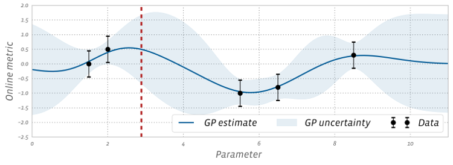
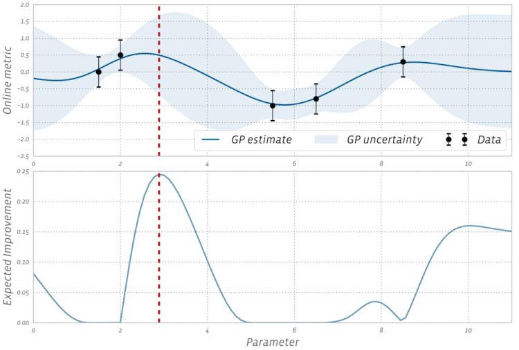
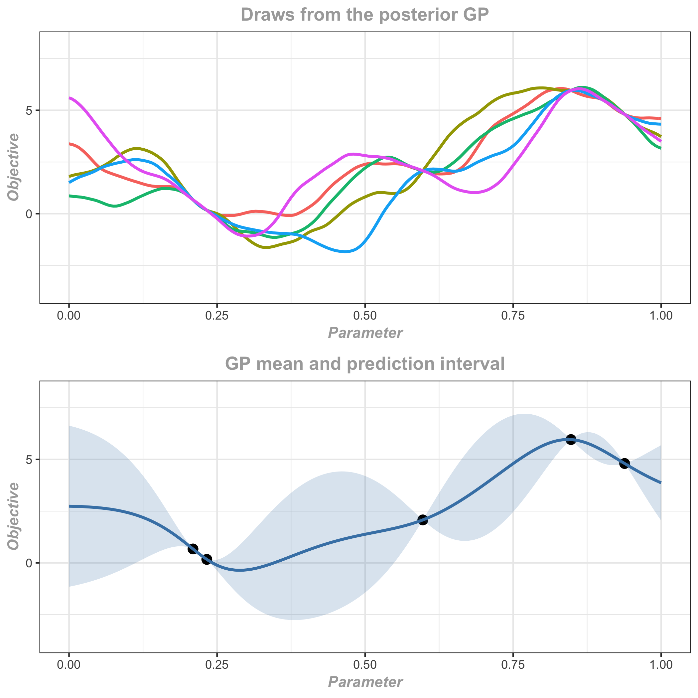

In complex engineering problems we often come across parameters that have to be tuned using several time-consuming and noisy evaluations. When the number of parameters is not small or some of the parameters are continuous, using large factorial designs (e.g., “grid search”) or global optimization techniques for optimization require more evaluations than is practically feasible. These types of problems show up in a diversity of applications, such as

1. Tuning Internet service parameters and selection of weights for recommender systems,
2. Hyperparameter optimization for machine learning,
3. Finding optimal set of gait parameters for locomotive control in robotics, and
4. Tuning design parameters and rule-of-thumb heuristics for hardware design.

Bayesian optimization (BO) allows us to tune parameters in relatively few iterations by building a smooth model from an initial set of parameterizations (referred to as the "surrogate model") in order to predict the outcomes for as yet unexplored parameterizations. BO is an adaptive approach where the observations from previous evaluations are used to decide what parameterizations to evaluate next. The same strategy can be used to predict the expected gain from all future evaluations and decide on early termination, if the expected benefit is smaller than what is worthwhile for the problem at hand.

## How does it work?

Parameter tuning is often done with simple strategies like grid search. However, grid search scales very poorly with the number of parameters (the dimensionality of the parameter space) and generally does not work well for more than a couple of continuous parameters. Alternative global optimization techniques like DIRECT or genetic algorithms are more flexible, but also typically require more evaluations than is feasible, especially in the presence of uncertainty.

Bayesian optimization starts by building a smooth surrogate model of the outcomes using Gaussian processes (GPs) based on the (possibly noisy) observations available from previous rounds of experimentation. See [below](bayesopt.md#a-closer-look-at-gaussian-processes) for more details on how the GP model works. This surrogate model can be used to make predictions at unobserved parameterizations and quantify the uncertainty around them. The predictions and the uncertainty estimates are combined to derive an acquisition function, which quantifies the value of observing a particular parameterization. We optimize the acquisition function to find the best configuration to observe, and then after observing the outcomes at that configuration a new surrogate model is fitted and the process is repeated until convergence. The entire process is adaptive in the sense that the predictions and uncertainty estimates are updated as new observations are made.

The strategy of relying on successive surrogate models to update knowledge of the objective allows BO to strike a balance between the conflicting goals of exploration (trying out parameterizations with high uncertainty in their outcomes) and exploitation (converging on configurations that are likely to be good).  As a result, BO is able to find better configurations with fewer evaluations than is generally possible with grid search or other global optimization techniques. This makes it a good choice for applications where a limited number of function evaluations can be made.

Figure 1 shows a 1D example, where a surrogate model is fitted to five noisy observations using GPs to predict the objective (solid line) and place uncertainty estimates (proportional to the width of the shaded bands) over the entire x-axis, which represents the range of possible parameter values. The model is able to predict the outcome of configurations that have not yet been tested. As intuitively expected, the uncertainty bands are tight in regions that are well-explored and become wider as we move away from them.

## Tradeoff between parallelism and total number of trials

In Bayesian Optimization (any optimization, really), we have the choice between performing evaluations of our function in a sequential fashion (i.e. only generate a new candidate point to evaluate after the previous candidate has been evaluated), or in a parallel fashion (where we evaluate multiple candidates concurrently). The sequential approach will (in expectation) produce better optimization results, since at any point during the optimization the ML model that drives it uses strictly more information than the parallel approach. However, if function evaluations take a long time and end-to-end optimization time is important, then the parallel approach becomes attractive. The difference between the performance of a sequential (aka 'fully adaptive') algorithm and that of a (partially) parallelized algorithm is referred to as the 'adaptivity gap'.

To balance end-to-end optimization time with finding the optimal solution in fewer trials, we opt for a ‘staggered’ approach by allowing a limited number of trials to be evaluated in parallel. By default, in simplified Ax APIs (e.g., in Service API) the allowed parallelism for the Bayesian phase of the optimization is 3. [Service API tutorial](https://ax.dev/tutorials/gpei_hartmann_service.html#How-many-trials-can-run-in-parallel?) has more information on how to handle and change allowed parallelism for that API.

For cases where its not too computationally expensive to run many trials (and therefore sample efficiency is less of a concern), higher parallelism can significantly speed up the end-to-end optimization time. By default, we recommend keeping the ratio of allowed parallelism to total trials relatively small (<10%) in order to not hurt optimization performance too much, but the reasonable ratio can differ depending on the specific setup.

## Acquisition functions

BoTorch — Ax's optimization engine — supports some of the most commonly used acquisition functions in BO like expected improvement (EI), probability of improvement, and upper confidence bound. Expected improvement is a popular acquisition function owing to its good practical performance and an analytic form that is easy to compute. As the name suggests it rewards evaluation of the objective $f$ based on the expected improvement relative to the current best. If $f^* = \max_i y_i$ is the current best observed outcome and our goal is to maximize $f$, then EI is defined as

$$ \text{EI}(x) = \mathbb{E}\bigl[\max(f(x) - f^*, 0)\bigr] $$

The parameterization with the highest EI is selected and evaluated in the next step. Using an acquisition function like EI to sample new points initially promotes quick exploration because its values, like the uncertainty estimates, are higher in unexplored regions. Once the parameter space is adequately explored, EI naturally narrows in on locations where there is a high likelihood of a good objective value.

The above definition of the EI function assumes that the objective function is observed free of noise. In many types of experiments, such as those found in A/B testing and reinforcement learning, the observations are typically noisy. For these cases, BoTorch implements an efficient variant of EI, called Noisy EI, which allow for optimization of highly noisy outcomes, along with any number of constraints (i.e., ensuring that auxiliary outcomes do not increase or decrease too much). Figure 2 shows how an EI acquisition function can be used in a noisy setting to seamlessly transition from exploration to optimization in BO.  For more on Noisy EI, [see our blog post](https://research.fb.com/efficient-tuning-of-online-systems-using-bayesian-optimization/).

## A closer look at Gaussian processes

How exactly do we model the true objective $f$ for making predictions about yet-to-be-explored regions using only a few noisy observations? GPs are a simple and powerful way of imposing assumptions over functions in the form of a probability distribution. The family of functions is characterized by,

1. A *mean function* that is the average of all functions, and,
2. A covariance or *kernel function* that provides an overall template for the look and feel of the individual functions (such as their shape or smoothness) and how much they can vary around the mean function.

In most applications of BO, a radial basis function (RBF) or Matern kernel is used because they allow us the flexibility to fit a wide variety of functions in high dimensions. By default, BoTorch uses the Matern 5/2 kernel, which tends to allow for less smooth surfaces compared to the RBF. For more mathematical details and intuitions about GPs and the different kernels check out [this tutorial](https://distill.pub/2019/visual-exploration-gaussian-processes).

In GP regression, the true objective is specified by a GP prior distribution with mean zero and a kernel function. Given a set of noisy observations from initial experimental evaluations, a Bayesian update gives the posterior distribution which is itself a GP with an updated mean and kernel function. The mean function of the posterior distribution gives the best prediction at any point conditional on the available observations, and the kernel function helps to quantify the uncertainty in the predictions in terms of posterior predictive intervals. Figure 3 shows three draws from the posterior GP as well as the predictions and posterior predictive intervals.

The kernel function has several hyperparameters that determine how smooth the GP posterior will be. For the predictions and uncertainty estimates to be practically useful, we have to make sure that the kernel is adapted to the observations. This is done by fitting the kernel hyperparameters to the data, usually by maximizing the marginal likelihood of the data, or with MCMC.

For detailed information about Ax's underlying Bayesian optimization engine, BoTorch, see the [BoTorch documentation](https://botorch.org/docs/introduction).
