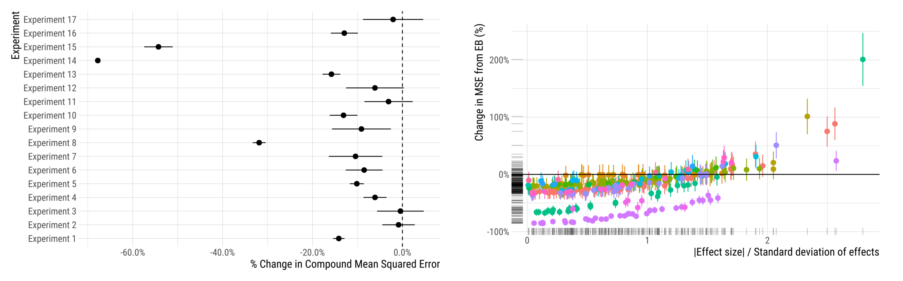
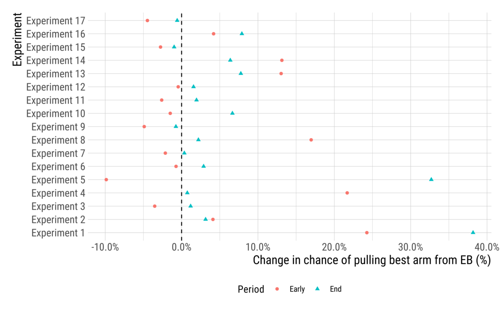

## What is empirical Bayes?

In short, empirical Bayes for experimentation consists of taking noisy estimates from a bunch of arms and shrinking the outlying ones a bit towards the overall central tendency across all arms.

The specific method we use is [James-Stein estimation](https://en.wikipedia.org/wiki/James%E2%80%93Stein_estimator). This method performs linear shrinkage. That means that, if multiple arms have mean estimates with similar levels of precision, they will be moved towards the mean proportionally to the distance they are from the mean. Doing this turns out to be optimal in the case of a Gaussian distribution of effects, but will improve accuracy even if that isn't the case (so long as there are [at least three means](https://projecteuclid.org/download/pdf_1/euclid.bsmsp/1200501656)).

Below are two experiments and how their estimates change as a result of applying the empirical Bayes estimator.

The experiment on the left had large effects relative to estimation variability and so shrinkage (visualized here as distance from the dashed $y=x$ line) was very small. On the right side, however, we can see an experiment where shrinkage makes a real difference. Effects far from the center of the distribution result in fairly substantial shrinkage, reducing the range of effects by nearly half. While effect estimates in the middle were largely unchanged, the largest observed effects went from around 17% before shrinkage to around 8% afterwards.

Our estimator is simply a linear combination of the mean across all arms and the mean of any single arm:
$$m_k^{JS} = \bar{m} + (1 - \xi_k) (m_k - \bar{m})$$

In this expression, $\bar{m}$ is the average effect over all arms, $m_k$ is the measured value in one particular arm indexed by $k$, and $\xi_k$ is the amount of shrinkage to apply. A value of $1$ corresponds with complete shrinkage to the mean. The level of shrinkage is determined as:
$$\xi_k = \min\left(\sigma_k^2 \frac{K-3}{s^2}, 1\right)$$
where $\sigma_k^2$ is the variance of arm $k$'s mean, $K$ indicates the total number of arms, and $s^2$ is the sum of squared deviations from the grand mean, $\bar{m}$. In essence, shrinkage is determined by the ratio of the variance in the estimation of a single effect relative to the total variation among effect estimates. When the two are of similar size, this is consistent with the existence of no actual treatment effects and, thus, shrinkage is large. When the former is very small relative to the latter (as in Experiment 5, above), then very little shrinkage is applied. The minimum of this ratio and $1$ is taken to ensure that shrinkage doesn't go past the grand mean. That is, no matter how large the sampling variability for an arm is relative to the overall dispersion of effects, the resulting estimate should never be on the other side of the mean from where it began.

We can approximate the variance of the empirical Bayes estimator with the following expression:
$$(1 - \xi_k)\sigma_k^2 + \frac{\xi_k s^2}{K} + \frac{2\xi_k^2(m_k - \bar{m})^2}{K-3}$$
This incorporates our sources of error from three components (from left to right): (i) error in estimating the mean of an individual group (ii) error in estimating the grand mean over all effects and (iii) error in estimating distance between an arm's effect and the grand mean.

## How does it help?

The most basic reason that empirical Bayes is effective is that it increases estimation accuracy. There are a few ways to think about this. I'll go through three: accuracy averaged across arms, accuracy in each arm and accuracy of resulting decisions made using these estimates.

To provide some evidence of its effectiveness, we'll look at data from 17 experiments conducted on Facebook News Feed. These were tests designed to optimize content -- wording, image and button text -- for "calls to action". The substance was typically mundane, encouraging users to upgrade their app versions, update their email addresses or donate to a charity of their choice. These were [full-factorial design experiments](https://en.wikipedia.org/wiki/Factorial_experiment). For more details on the simulation studies, [see our paper](https://ddimmery.com/publication/experiment-shrinkage/).

### Improved Accuracy in one-shot experimentation

The left hand chart shows that for all experiments evaluated, the average estimation error (measured in terms of [mean squared error](https://en.wikipedia.org/wiki/Mean_squared_error)) was reduced by the use of empirical Bayes. These gains were typically on the order of 5 to 20%, but some experiments saw much larger gains. Experiment 14 (also highlighted in the first figure) saw large gains from shrinkage (around 60% reduction in mean squared error!) by reducing the magnitude of the misleadingly large effects seen in the raw data.

The right hand plot shows that within experiments, the vast majority of experimental groups (around 90%) were estimated more accurately using empirical Bayes. Moreover, the arms which tended to have increases in error were those arms with the largest effects. Understating the effects of such arms is usually not a very big deal when making launch decisions, however, as one is usually most interested in which arm is the best. We can look at the more formally by considering the decisions made in sequential experiments when effects are estimated using empirical Bayes.

We have additional results [in our paper](https://ddimmery.com/publication/experiment-shrinkage/) describing how frequentist coverage is affected by the use of empirical Bayes (short version: it looks a lot like the results on accuracy).

### Better sequential decision making

To see how empirical Bayes affects decision making, we use it to estimate effects and see how it affects the performance in [bandit optimization](banditopt.md) using Thompson sampling. In particular, the following evaluation looks at the performance early (25% through the experiment) and upon completion.

By the end of almost every experiment, empirical Bayes does a better job of playing the best arm than does using the raw effect estimates. It does this by concentrating exploration early in the experiment. In particular, it concentrates that exploration on the *set* of arms that look good, rather than over-exploiting the single best performing arm. By spreading exploration out a little bit more when effect estimates are noisy (and playing the best arm a little less), it is able to identify the best arm with more confidence later in the experiment.

More details are available [in our paper](https://ddimmery.com/publication/experiment-shrinkage/), including results demonstrating reductions in [regret](https://en.wikipedia.org/wiki/Multi-armed_bandit#The_multi-armed_bandit_model) from the use of empirical Bayes.
