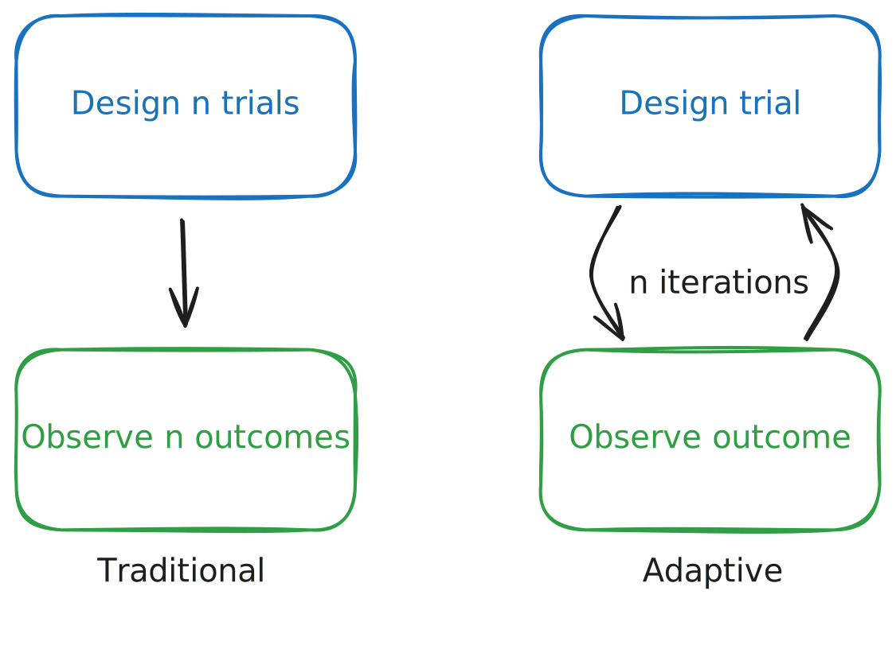
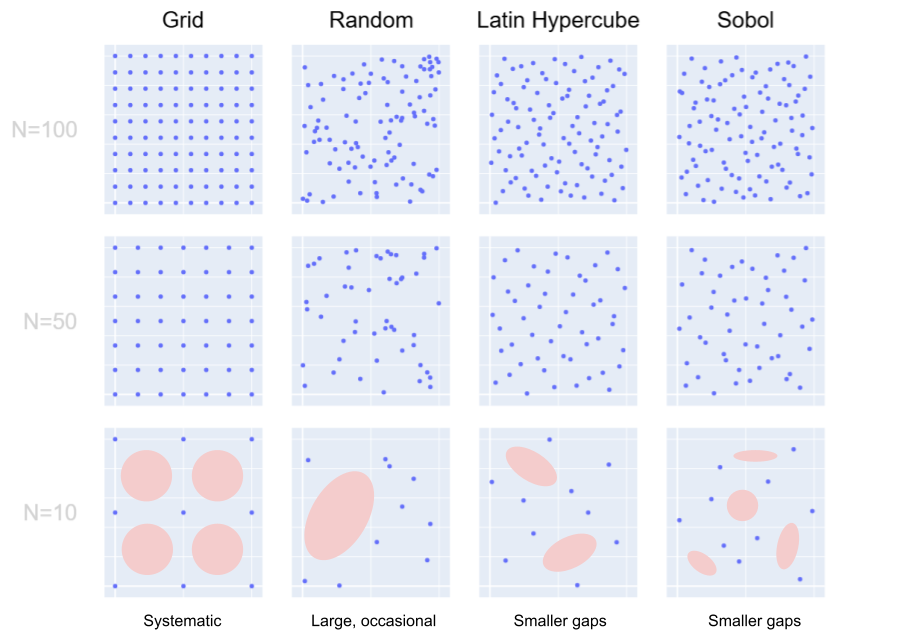
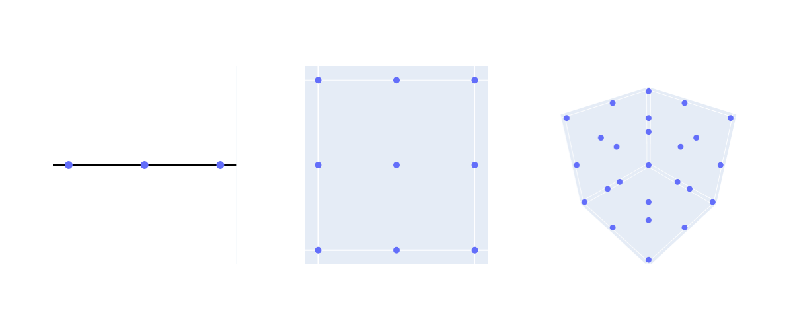
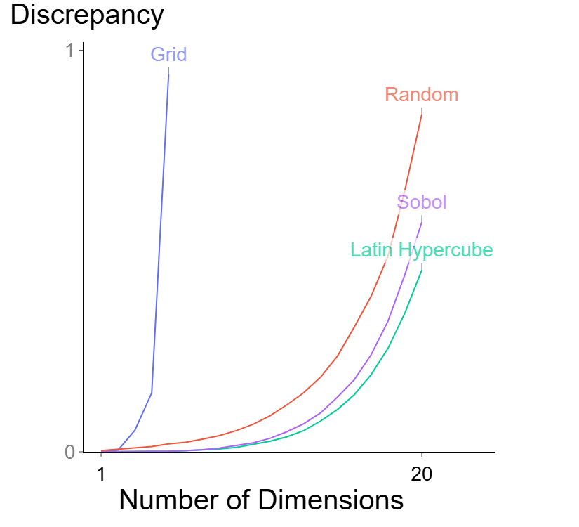

# Introduction to Adaptive Experimentation

In engineering tasks we often encounter so called "black box" optimization problems, situations where the relationship between inputs and outputs of a system don’t have a closed-form solution and cannot be easily modeled.
In these scenarious practitioners must tune parameters using many time- and/or resource-consuming trials.
For example:
* Machine learning engineers may seek optimal hyperparameters such as learning rate or number of training steps to maximize accuracy or minimize size/runtime for a model.
* Roboticists may seek to jointly find optimal gait parameters such as stride length or foot angle to maximize walking speed for a legged robot.
* Materials scientists may seek to find the composition and heat treatment parameters that maximize strength for an aerospace alloy.
* Chemists may seek to find the synthesis path for a molecule that is likely to be a good drug candidate for an infectious disease.

Adaptive experimentation is an approach to solving these problems efficiently by leveraging data from prior iterations to inform future decisions on wchih trials to run next.

## Traditional methods are inefficient, especially in high dimensions
To solve black box problems, there are two common approaches to suggest what points or “trials” to evaluate (i.e., measurements of objective(s) for a given set of input parameters).
One is to use manual trial-and-error based on intuition.
The second is a more systematic method called “design of experiments” (DoE).
These methods can provide a strong understanding of the relationship between the inputs and outputs of a system by providing broad coverage of the entire input space.
Examples of traditional DoE methods include testing points on an equally spaced grid or randomly picking parameter combinations, called grid search and random search respectively.
Although somewhat counterintuitive, random search is often more effective than grid search because it avoids systematic gaps.
An alternative class of methods referred to as quasi-random search offer the "best of both worlds" between grid and random search by strategically selecting points that are more uniformly dispersed.
Examples include Sobol sampling and Latin Hypercube Sampling, which both rely on some form of subdividing a search space and assigning points in relation to these subdivisions.

Unfortunately getting broad coverage of the domain requires many samples, which can be expensive.
Worse, as more dimensions are added more points are required to achieve the same coverage.
To illustrate, imagine points distributed on a line (1D), a square (2D), and a cube (3D).

Notice how even though there are 9x more points in the cube than on the line, the [discrepancy](https://en.wikipedia.org/wiki/Equidistributed_sequence#Discrepancy) is 3x higher than for the line (0.100 vs. 0.028).
This is often referred to as the ["curse of dimensionality"](https://en.wikipedia.org/wiki/Curse_of_dimensionality).

|             |  Line | Square |  Cube | Hypercube |
|-------------|:-----:|:------:|:-----:|:---------:|
| Num. Points |   $$3^1$$  |   $$3^2$$   |   $$3^3$$  |     $$n^d$$    |
| Discrepancy | $$0.028$$  |  $$0.061$$  | $$0.100$$  |  $$f(3, d)$$   |

Real-world black box optimization tasks often have many dimensions and can only afford to conduct very few trials.
For example, imagine you have a budget of 100 trials and are optimizing over a parameter space with 20 dimensions.
The differences in discrepancy between algorithms can become drastic, as shown below.
In the case of grid search, to have even just two subdivisions in each of 20 dimensions would require $$20^2 = 400$$ points, well over our 100 point budget!

## Adaptive experimentation outperforms traditional methods
Although simple to implement, traditional DoE methods such as grid search, random search, and quasi-random search are uninformed, meaning they do not incorporate information about the objective function to be optimized.
Likewise, manual trial-and-error can be slow, expensive, and too complicated to effectively reason about; domain experts often restrict their search space to just a few parameters to help it feel like it’s something they can handle.

Adaptive experimentation is a more efficient version of DoE that iteratively incorporates information from prior results to suggest the next parameter set to run.
A typical adaptive experiment involves the following series of steps:
1. **Configure** your optimization experiment, defining the search space, objective(s), constraints, etc.
2. **Suggest** new trials, either one at a time or in a batch
3. **Evaluate** the suggested trials by executing the black box function and reporting the results back to the optimization algorithm
4. **Repeat** steps 2 and 3 until a stopping condition is met or the evaluation budget is exhausted

Bayesian optimization, one of the most effective forms of adaptive experimentation, uses acquisition functions to intelligently balance the tradeoffs between exploration (learning how new parameterizations perform) and exploitation (refining parameterizations previously observed to be good).
To achieve this, one must also create a surrogate model that predicts the average behavior and the uncertainty of the objective(s) as a function of the input parameters
Typically this surrogate model is much less expensive to evaluate than the true, underlying black box function.

Black box optimization problems are everywhere, whether in machine learning, robotics, materials science, or chemistry.
Moving from manual trial-and-error and uninformed strategies such as grid, random, and quasi-random search to an adaptive experimentation setup can dramatically improve optimization performance, whether it’s a state-of-the-art machine learning model, a faster robot, a stronger alloy, or a better medicine.
