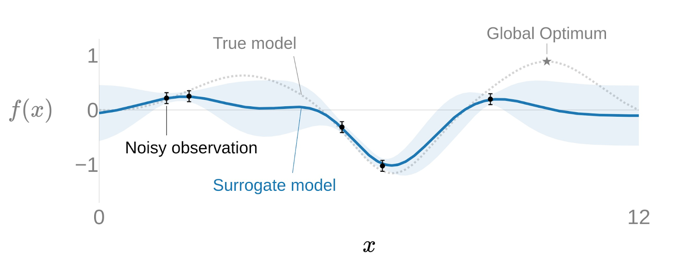
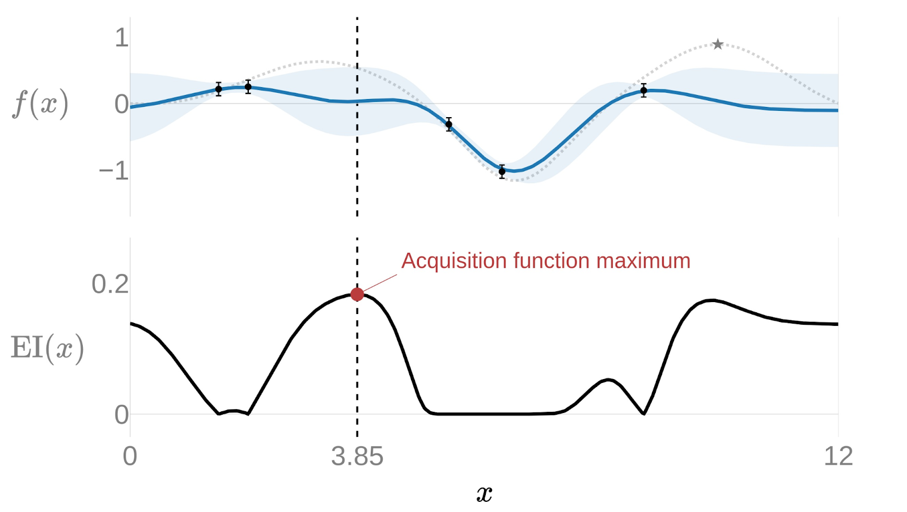
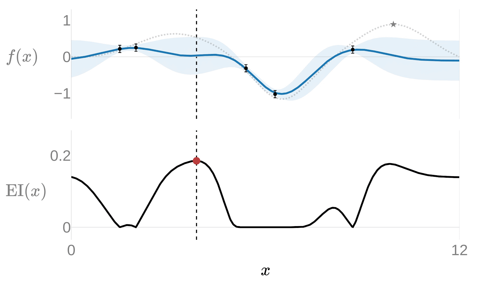

# Introduction to Bayesian Optimization

Bayesian optimization (BO) is a highly effective adaptive experimentation method
that excels at balancing exploration (learning how new parameterizations
perform) and exploitation (refining parameterizations previously observed to be
good). This method is the foundation of Ax's optimization.

BO has seen widespread use across a variety of domains. Notable examples include
its use in
[tuning the hyperparameters of AlphaGo](https://www.nature.com/articles/nature16961),
a landmark model that defeated world champions in the board game Go. In
materials science, researchers used BO to accelerate the curing process,
increase the overall strength, and reduce the CO2 emissions of
[concrete formulations](https://arxiv.org/abs/2310.18288), the most abundant
human-made material in history. In chemistry, researchers used it to
[discover 21 new, state-of-the-art molecules for tunable dye lasers](https://www.science.org/doi/10.1126/science.adk9227)
(frequently used in quantum physics research), including the world’s brightest
molecule, while only a dozen or so had been discovered over the course of
decades.

Ax relies on [BoTorch](https://botorch.org/) for its implementation of
state-of-the-art Bayesian optimization components.

## Bayesian Optimization

Bayesian optimization begins by building a smooth surrogate model of the
outcomes using a statistical model. This surrogate model makes predictions at
unobserved parameterizations and estimate the uncertainty around them. The
predictions and the uncertainty estimates are combined to derive an acquisition
function, which quantifies the value of observing a particular parameterization.
By optimizing the acquisition function we identify the best candidate
parameterizations for evaluation. In an iterative process, we fit the surrogate
model with newly observed data, optimize the acquisition function to identify
the best configuration to observe, then fit a new surrogate model with the newly
observed outcomes. The entire process is adaptive where the predictions and
uncertainty estimates are updated as new observations are made.

The strategy of relying on successive surrogate models to update knowledge of
the objective allows BO to strike a balance between the conflicting goals of
exploration (trying out parameterizations with high uncertainty in their
outcomes) and exploitation (converging on configurations that are likely to be
good). As a result, BO is able to find better configurations with fewer
evaluations than is generally possible with grid search or other global
optimization techniques. Therefore, leveraging BO as is done in Ax, is
particularly impactful for applications where the evaluation process is
expensive, allowing for only a limited number of evaluations

## Surrogate Models

Because the objective function is a black-box process, we treat it as a random
function and place a prior over it. This prior captures beliefs about the
objective, and it is updated as data is observed to form the posterior.

This is typically done using a Gaussian process (GP), a probabilistic model that
defines a probability distribution over possible functions that fit a set of
points. Importantly for Bayesian Optimization, GPs can be used to map points in
input space (the parameters we wish to tune) to distributions in output space
(the objectives we wish to optimize).

In the one-dimensional example below, a surrogate model is fit to five noisy
observations using a GP to predict the objective, depicted by the solid line,
and uncertainty estimates, illustrated by the width of the shaded bands. This
objective is predicted for the entire range of possible parameter values,
corresponding to the full x-axis. Importantly, the model is able to predict the
outcome and quantify the uncertainty of configurations that have not yet been
tested. Intuitively, the uncertainty bands are tight in regions that are
well-explored and become wider as we move away from them.

## Acquisition Functions

The acquisition function is a mathematical function that quantifies the utility
of observing a given point in the domain. Ax supports the most commonly used
acquisition functions in BO, including:

- **Expected Improvement (EI)**, which captures the expected value of a point
  above the current best value.
- **Probability of Improvement (PI)**, which captures the probability of a point
  producing an observation better than the current best value.
- **Upper Confidence Bound (UCB)**, which sums the predicted mean and standard
  deviation.

Each of these acquisition functions will lead to different behavior during the
optimization. Additionally, many of these acquisition functions have been
extended to perform well in constrained, noisy, multi-objective, and/or batched
settings.

Expected Improvement is a popular acquisition function owing to well balanced
exploitation vs exploration, a straighforward analytic form, and overall good
practical performance. As the name suggests, it rewards evaluation of the
objective $$f$$ based on the expected improvement relative to the current best.
If $$f^* = \max_i y_i$$ is the current best observed outcome and our goal is to
maximize $f$, then EI is defined as the following:

$$
\text{EI}(x) = \mathbb{E}\bigl[\max(f(x) - f^*, 0)\bigr]
$$

A visualization of the expected improvement based on the surrogate model
predictions is shown below, where the next suggestion is where the expected
improvement is at its maximum.

Once a new highest EI is selected and evaluated, the surrogate model is
retrained and a new suggestion is made. As described above, this process
continues iteratively until a stopping condition, set by the user, is reached.

Using an acquisition function like EI to sample new points initially promotes
quick exploration because the expected values, informed by the uncertainty
estimates, are higher in unexplored regions. Once the parameter space is
adequately explored, EI naturally narrows focuses on regions where there is a
high likelihood of a good objective value (ie exploitation).

While the combination of a Gaussian process surrogate model and the expected
improvement acquisition function is shown above, different combinations of
surrogate models and acquisition functions can be used. Different surrogates,
either differently configured GPs or entirely different probabilistic models, or
different acquisition functions present various tradeoffs in terms of
optimization performance, computational load, and more.
