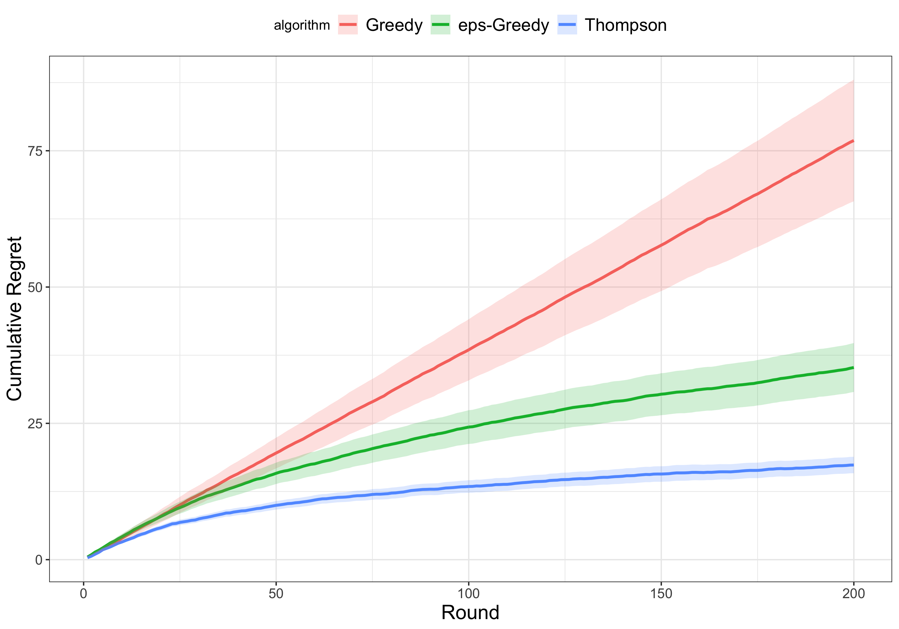
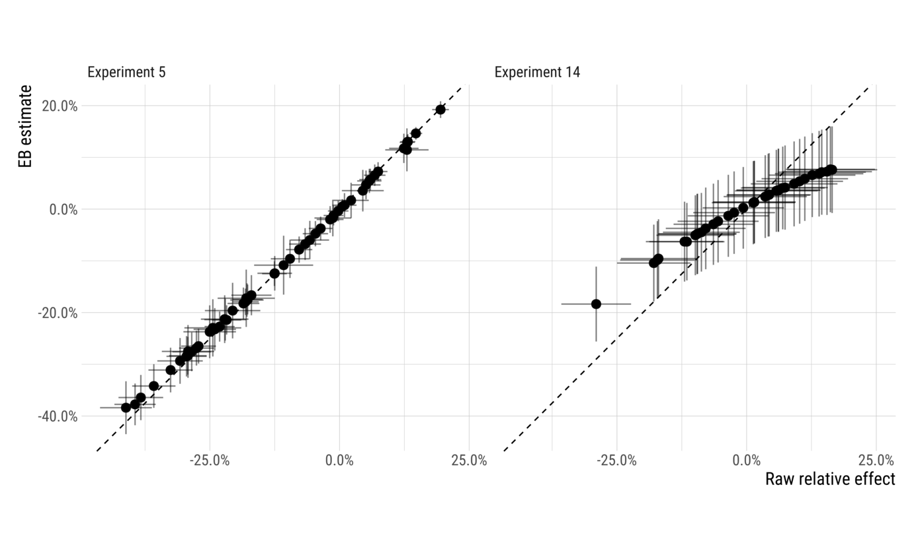

Many decision problems require choosing from a discrete set of candidates, and for these problems Ax uses bandit optimization. In contrast to [Bayesian optimization](bayesopt.md) — which provides a solution for problems with continuous parameters and an infinite number of potential options — bandit optimization is used for problems with a finite set of choices. Most ordinary A/B tests, in which a handful of options are evaluated against each other, fall into this category. Experimenters typically perform such tests by allocating a fixed percentage of experimental units to each choice, waiting to collect data about each, and then choosing a winner. In the case of an online system receiving incoming requests, this can be done by splitting traffic amongst the choices. However, with more than just a few options A/B tests quickly become prohibitively resource-intensive, largely because all choices — no matter how good or bad they appear — receive the same traffic allocation.

Bandit optimization allocates traffic more efficiently among these discrete choices by sequentially updating the allocation of traffic based on each candidate's performance so far. The key problem for bandit optimization algorithms is balancing exploration (sending traffic to candidates that have the potential to perform well) with exploitation (sending traffic to candidates which already appear to perform well). This trade-off is very similar to the underlying exploration problem highlighted in Bayesian Optimization [acquisition functions](bayesopt.md#acquisition-functions).

Bandit optimization is more sample efficient than traditional static A/B tests: it acquires a greater reward for the same amount of experimentation. Consequently, it is safer with larger cohorts because the samples are automatically diverted towards the good parameter values (and away from the bad ones).

## How does it work?

Ax relies on the simple and effective [Thompson sampling](https://en.wikipedia.org/wiki/Thompson_sampling) algorithm for performing bandit optimization. There is a clear intuition to this method: select a parameterization (referred to from now on as an "arm") with a probability proportional to that arm being the best. This algorithm is easy to implement and has strong guarantees of converging to an arm that is close to the best — all without any human intervention. To understand how this works, we describe an advertising optimization problem in which we want to choose arms which maximize the click-through rate (CTR) and the rewards are binary: either clicks (successes) or views without clicks (failures).

As we run the experiment, we develop more precise estimates of the performance of each arm. More precisely, in each iteration, we draw samples from the distribution of plausible effects for each arm, and we record the largest sampled value. We repeat this process many times, until settling on a final distribution of maximal arms, which determines how we assign users to arms going forward. This process rapidly narrows down our set of arms to only the very best performers.

The following figure is an example of how assignment probabilities for an experiment with 10 arms may evolve over 20 iterations of batch-based Thompson sampling:

The process starts by distributing users equally among all of the arms. Bandit optimization then produces updated assignment probabilities (represented here by the height of the colored bars in each column) based on the average CTR observed up until that point. Since the true CTR is highest for the second arm, followed by the first arm, in this simulated example those arms are subsequently given larger allocations over 20 rounds of optimization.

Early in the process, the uncertainty in our estimates of CTR means that the bandit optimization spreads samples somewhat evenly amongst arms. This helps us obtain better estimates for all of the arms and allows us to start focusing in on those which perform well. The following figure animates this evolution. The small blue x indicates the observed CTRs within each round, while the solid round symbol (and gray error bars) indicate our aggregated estimates across all rounds. Arms 3 through 8 are sampled just often enough to get a rough estimate that their CTRs are low, and the algorithm then focuses further exploration on the first two arms to better identify which is the best. This example can be viewed as a discretized version of the animated example of [Bayesian optimization](bayesopt.md).

## How well does it work?

We want a bandit algorithm to maximize the total rewards over time or equivalently, to minimize the regret, which is defined as the cumulative difference between the highest possible reward and the actual reward at a point in time. In our running example, regret is the number of clicks we "left on the table" through our choice of allocation procedure. We can imagine two extremes:

1.  Pure exploration, in which we just always allocate users evenly across all conditions. This is the standard approach to A/B tests.
2.  Pure exploitation, in which we simply allocate all users to the arm we think is most likely to be best.

Both of these extremes will do a poor job of minimizing our regret, so our aim is to balance them.

The following figure compares the cumulative regret of three different approaches to bandit optimization for 200 rounds of experimentation on our running example:

1.  Thompson sampling: the primary approach used by Ax, described above
2.  Greedy: select the arm with the current best reward
3.  Epsilon-greedy: randomly picks an arm $e$ percent of the time, picks the current best arm $100-e$ percent of the time

The regret of the purely greedy approach is the highest amongst the three approaches. A little bit of exploration, as in the epsilon-greedy approach with $e = 10$, leads to much less regret over time. Thompson sampling best balances the tradeoff between exploration and exploitation, and thus outperforms the other two approaches.

As it turns out, we can do even better by applying a simple model.

## Empirical Bayes

In short, our empirical Bayes model consists of taking noisy estimates from a bunch of arms and "shrinking" the outlying ones a bit towards the overall central tendency across all arms.

The specific method we use is [James-Stein estimation](https://en.wikipedia.org/wiki/James%E2%80%93Stein_estimator). This method is linear, which means that if multiple arms have estimates with similar levels of precision, they will be moved towards the middle of the effect distribution proportionally to their distance from the middle. Doing this turns out to be optimal in the case of a Gaussian distribution of effects, but will improve accuracy even if that isn't the case (so long as there are [at least three means](https://projecteuclid.org/download/pdf_1/euclid.bsmsp/1200501656)).

The diagram below illustrates how the estimates of two different experiments change as a result of applying the empirical Bayes estimator.

The experiment on the left has large effects relative to estimation variability, and so shrinkage (visualized here as distance from the dashed $y=x$ line), is very small. On the right side, however, we can see an experiment where shrinkage makes a significant difference. Effects far from the center of the distribution result in fairly substantial shrinkage, reducing the range of effects by nearly half. While effect estimates in the middle were largely unchanged, the largest observed effects went from around 17% before shrinkage to around 8% afterwards.

The vast majority of experimental groups are estimated more accurately using empirical Bayes. The arms which tend to have increases in error are those with the largest effects. Understating the effects of such arms is usually not a very big deal when making launch decisions, however, as one is usually most interested in _which_ arm is the best rather than exactly how good it is.

Using Empirical Bayes does better at allocating users to the best arm than does using the raw effect estimates. It does this by concentrating exploration early in the experiment. In particular, it concentrates that exploration on the _set_ of arms that look good, rather than over-exploiting the single best performing arm. By spreading exploration out a little bit more when effect estimates are noisy (and playing the best arm a little less), it is able to identify the best arm with more confidence later in the experiment.

See more [details in our paper](https://arxiv.org/abs/1904.12918).
