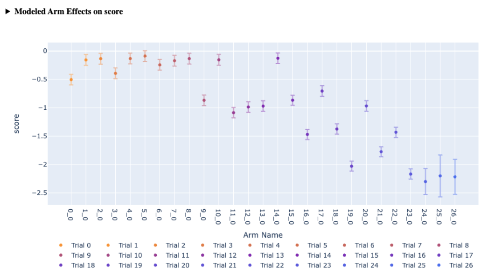
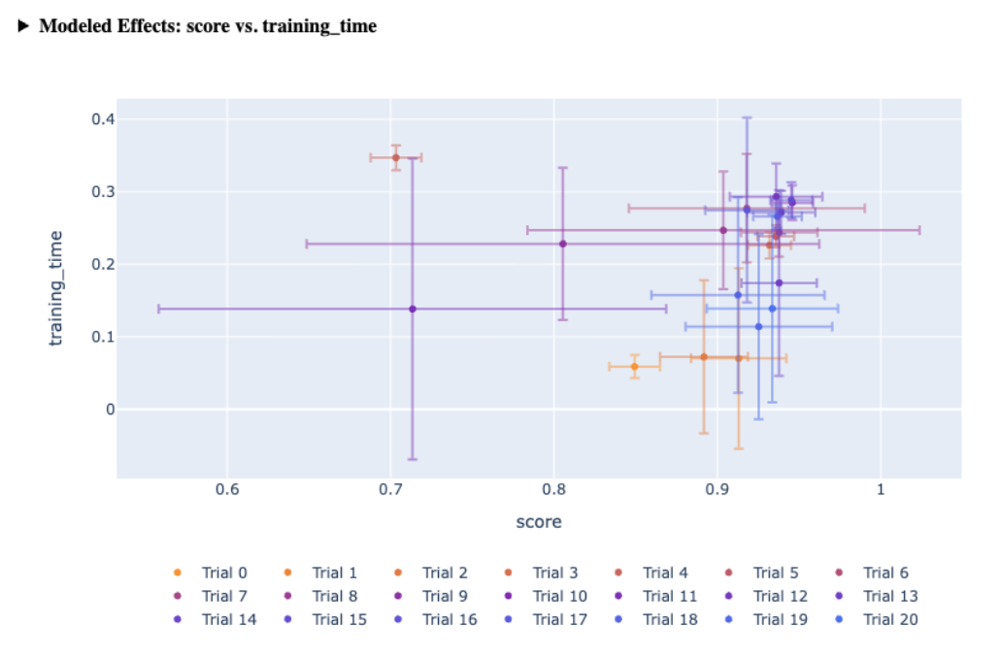
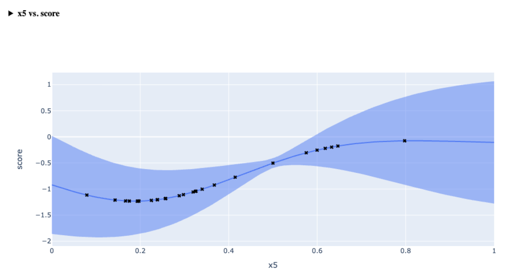
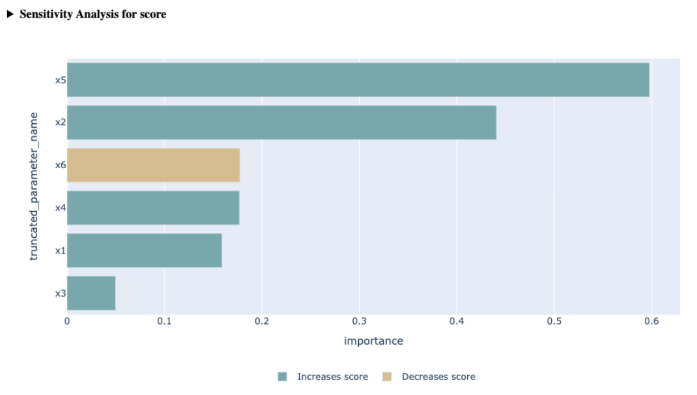
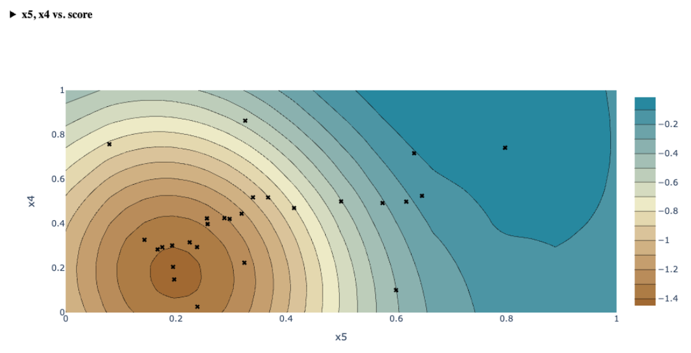
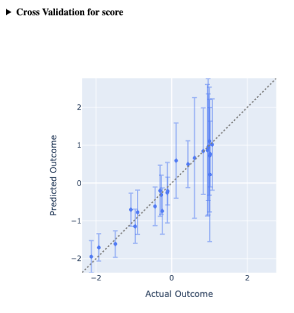
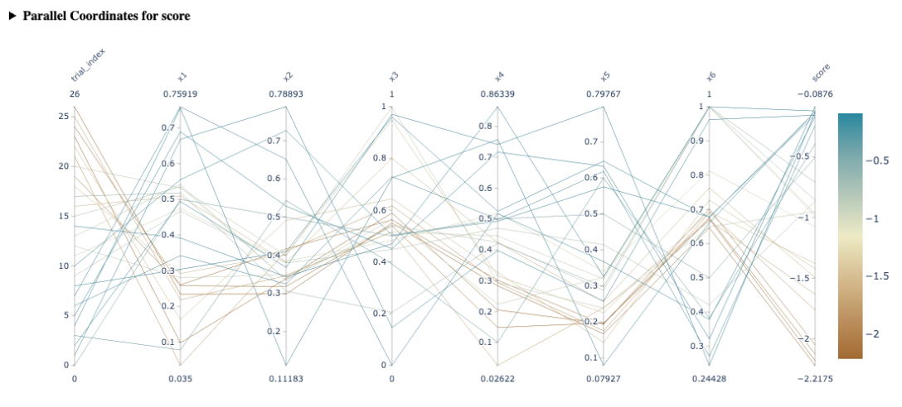
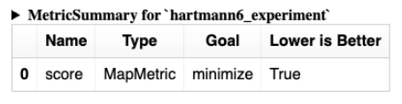
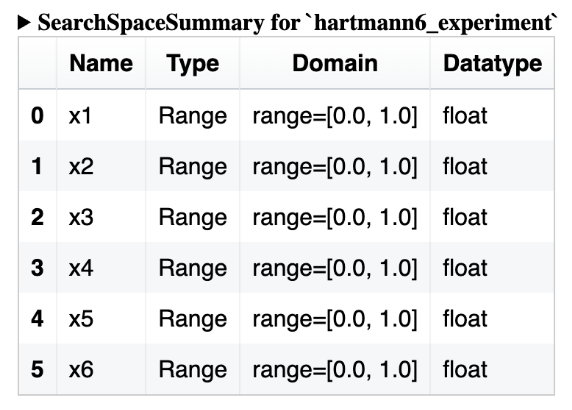

import LinkButtons from "@site/src/components/LinkButtons.jsx";
import CellOutput from "@site/src/components/CellOutput.jsx";
import {PlotlyFigure} from "@site/src/components/Plotting.jsx";

<LinkButtons
  githubUrl="https://github.com/facebook/ax/blob/main/tutorials/analyses/analyses.ipynb"
  colabUrl="https://colab.research.google.com/github/facebook/ax/blob/main/tutorials/analyses/analyses.ipynb"
/>

> **⚠ INFO ⚠**
>
> This document discusses non-API components of Ax, which may be subject to backwards
> compatibility breaking changes between major library versions.

# Utilizing and Creating Ax Analyses

Ax’s Analysis module provides a framework for producing plots, tables, messages, and
more to help users understand their experiments. This is facilitated via the `Analysis`
protocol and its various subclasses.

Analysis classes implement a method `compute` which consumes an `Experiment`,
`GenerationStrategy`, and/or `Adapter` and outputs an `AnalysisCardBase`. This can
either be an `AnalysisCard`, which contains a dataframe with relevant data, a “blob”
which contains data to be rendered (ex. a plot), and miscellaneous metadata like a title
and subtitle. It could also be an `AnalysisCardGroup` which contains a name and list of
children `AnalyisCardBase` -- this allows cards to exist within nested groups as is
relevant. For example: the `TopSurfacesPlot` computes a `SensitivityAnalysisPlot` to
understand which parameters in the search space are most relevent, then produces
`SlicePlot`s and `ContourPlot`s for the most important surfaces.

Importantly Ax is able to save these cards to the database using `save_analysis_cards`,
allowing for analyses to be pre-computed and displayed at a later time. This is done
automatically when `Client.compute_analyses` is called.

## Using Analyses

The simplest way to use an `Analysis` is to call `Client.compute_analyses`. This will
heuristically select the most relevant analyses to compute, save the cards to the
database, return them, and display them in your IPython environment if possible. Users
can also specify which analyses to compute and pass them in manually, for example:
`client.compute_analyses(analyses=[TopSurfacesPlot(), Summary(), ...])`.

When developing a new `Analysis` it can be useful to compute an analysis "a-la carte".
To do this, manually instantiate the `Analysis` and call its `compute` method. This will
return a collection of `AnalysisCards` which can be displayed.

```python
from ax import Client, RangeParameterConfig

# Create a Client and populate it with some data
client = Client()
client.configure_experiment(
    name="booth_function",
    parameters=[
        RangeParameterConfig(
            name="x1",
            bounds=(-10.0, 10.0),
            parameter_type="float",
        ),
        RangeParameterConfig(
            name="x2",
            bounds=(-10.0, 10.0),
            parameter_type="float",
        ),
    ],
)
client.configure_optimization(objective="-1 * booth")

for _ in range(10):
    for trial_index, parameters in client.get_next_trials(max_trials=1).items():
        client.complete_trial(
            trial_index=trial_index,
            raw_data={
                "booth": (parameters["x1"] + 2 * parameters["x2"] - 7) ** 2
                + (2 * parameters["x1"] + parameters["x2"] - 5) ** 2
            },
        )
```

<CellOutput>
{
`[INFO 09-05 19:27:22] ax.api.client: GenerationStrategy(name='Center+Sobol+MBM:fast', nodes=[CenterGenerationNode(next_node_name='Sobol'), GenerationNode(node_name='Sobol', generator_specs=[GeneratorSpec(generator_enum=Sobol, model_key_override=None)], transition_criteria=[MinTrials(transition_to='MBM'), MinTrials(transition_to='MBM')]), GenerationNode(node_name='MBM', generator_specs=[GeneratorSpec(generator_enum=BoTorch, model_key_override=None)], transition_criteria=[])]) chosen based on user input and problem structure.
[INFO 09-05 19:27:22] ax.api.client: Generated new trial 0 with parameters {'x1': 0.0, 'x2': 0.0} using GenerationNode CenterOfSearchSpace.
[INFO 09-05 19:27:22] ax.api.client: Trial 0 marked COMPLETED.
[INFO 09-05 19:27:22] ax.api.client: Generated new trial 1 with parameters {'x1': -1.367015, 'x2': 0.68437} using GenerationNode Sobol.
[INFO 09-05 19:27:22] ax.api.client: Trial 1 marked COMPLETED.
[INFO 09-05 19:27:22] ax.api.client: Generated new trial 2 with parameters {'x1': 9.451131, 'x2': -7.811417} using GenerationNode Sobol.
[INFO 09-05 19:27:22] ax.api.client: Trial 2 marked COMPLETED.
[INFO 09-05 19:27:22] ax.api.client: Generated new trial 3 with parameters {'x1': 2.865975, 'x2': 8.128145} using GenerationNode Sobol.
[INFO 09-05 19:27:22] ax.api.client: Trial 3 marked COMPLETED.
[INFO 09-05 19:27:22] ax.api.client: Generated new trial 4 with parameters {'x1': -6.02818, 'x2': -0.250462} using GenerationNode Sobol.
[INFO 09-05 19:27:22] ax.api.client: Trial 4 marked COMPLETED.
[INFO 09-05 19:27:22] ax.api.client: Generated new trial 5 with parameters {'x1': -0.382917, 'x2': -8.719841} using GenerationNode MBM.
[INFO 09-05 19:27:22] ax.api.client: Trial 5 marked COMPLETED.
[INFO 09-05 19:27:23] ax.api.client: Generated new trial 6 with parameters {'x1': 1.254811, 'x2': 2.653616} using GenerationNode MBM.
[INFO 09-05 19:27:23] ax.api.client: Trial 6 marked COMPLETED.
[INFO 09-05 19:27:23] ax.api.client: Generated new trial 7 with parameters {'x1': 7.729666, 'x2': 0.119344} using GenerationNode MBM.
[INFO 09-05 19:27:23] ax.api.client: Trial 7 marked COMPLETED.
[INFO 09-05 19:27:24] ax.api.client: Generated new trial 8 with parameters {'x1': 2.613282, 'x2': 1.381668} using GenerationNode MBM.
[INFO 09-05 19:27:24] ax.api.client: Trial 8 marked COMPLETED.
[INFO 09-05 19:27:24] ax.api.client: Generated new trial 9 with parameters {'x1': -5.22407, 'x2': 10.0} using GenerationNode MBM.
[INFO 09-05 19:27:24] ax.api.client: Trial 9 marked COMPLETED.`
}
</CellOutput>

```python
from ax.analysis.plotly.parallel_coordinates import ParallelCoordinatesPlot

analysis = ParallelCoordinatesPlot()

analysis.compute(
    experiment=client._experiment,
    generation_strategy=client._generation_strategy,
    # compute can optionally take in an Adapter directly instead of a GenerationStrategy
    adapter=None,
)
```

**Parallel Coordinates for booth**

The parallel coordinates plot displays multi-dimensional data by representing each
parameter as a parallel axis. This plot helps in assessing how thoroughly the search
space has been explored and in identifying patterns or clusterings associated with
high-performing (good) or low-performing (bad) arms. By tracing lines across the axes,
one can observe correlations and interactions between parameters, gaining insights into
the relationships that contribute to the success or failure of different configurations
within the experiment.


<PlotlyFigure data={require('./assets/plot_data/ea805ad8-2f48-4c81-b9af-c243f97d88d6.json')} />

## Creating a new Analysis

Let's implement a simple Analysis that returns a table counting the number of trials in
each `TrialStatus` . We'll make a new class that implements the `Analysis` protocol
(i.e. it defines a `compute` method).

```python
import random
from typing import Sequence

import pandas as pd

from ax.analysis.analysis import (
    Analysis,
    AnalysisCard,
)

from ax.core.experiment import Experiment
from ax.generation_strategy.generation_strategy import GenerationStrategy
from ax.adapter.base import Adapter


class TrialStatusTable(Analysis):
    def compute(
        self,
        experiment: Experiment | None = None,
        generation_strategy: GenerationStrategy | None = None,
        adapter: Adapter | None = None,
    ) -> AnalysisCard:
        trials_by_status = experiment.trials_by_status

        records = [
            {"status": status.name, "count": len(trials)}
            for status, trials in trials_by_status.items()
            if len(trials) > 0
        ]

        return self._create_analysis_card(
            title="Trials by Status",
            subtitle="How many trials are in each status?",
            df=pd.DataFrame.from_records(records),
        )


# Let's add some more trials of miscellaneous statuses before computing the new Analysis
for _ in range(10):
    for trial_index, parameters in client.get_next_trials(max_trials=1).items():
        roll = random.random()

        if roll < 0.2:
            client.mark_trial_failed(trial_index=trial_index)
        elif roll < 0.5:
            client.mark_trial_abandoned(trial_index=trial_index)
        else:
            client.complete_trial(
                trial_index=trial_index,
                raw_data={
                    "booth": (parameters["x1"] + 2 * parameters["x2"] - 7) ** 2
                    + (2 * parameters["x1"] + parameters["x2"] - 5) ** 2
                },
            )

# Client.compute_analyses will display cards individually if display=True
card = client.compute_analyses(analyses=[TrialStatusTable()], display=True)
```

<CellOutput>
{
`[INFO 09-05 19:27:28] ax.api.client: Generated new trial 10 with parameters {'x1': -10.0, 'x2': 10.0} using GenerationNode MBM.
[INFO 09-05 19:27:28] ax.api.client: Trial 10 marked COMPLETED.
[INFO 09-05 19:27:29] ax.api.client: Generated new trial 11 with parameters {'x1': -2.096799, 'x2': 5.573503} using GenerationNode MBM.
[INFO 09-05 19:27:29] ax.api.client: Trial 11 marked COMPLETED.
[INFO 09-05 19:27:29] ax.api.client: Generated new trial 12 with parameters {'x1': 0.241585, 'x2': 3.047985} using GenerationNode MBM.
[INFO 09-05 19:27:29] ax.api.client: Trial 12 marked FAILED.
[INFO 09-05 19:27:30] ax.api.client: Generated new trial 13 with parameters {'x1': 0.232527, 'x2': 3.047926} using GenerationNode MBM.
[INFO 09-05 19:27:30] ax.api.client: Trial 13 marked FAILED.
[INFO 09-05 19:27:30] ax.api.client: Generated new trial 14 with parameters {'x1': 0.264755, 'x2': 3.023053} using GenerationNode MBM.
[INFO 09-05 19:27:30] ax.api.client: Trial 14 marked ABANDONED. ABANDONED trials are not able to be re-suggested by get_next_trials.
[INFO 09-05 19:27:31] ax.api.client: Generated new trial 15 with parameters {'x1': 4.480106, 'x2': -1.212687} using GenerationNode MBM.
[INFO 09-05 19:27:31] ax.api.client: Trial 15 marked COMPLETED.
[INFO 09-05 19:27:31] ax.api.client: Generated new trial 16 with parameters {'x1': 1.637424, 'x2': 1.594221} using GenerationNode MBM.
[INFO 09-05 19:27:31] ax.api.client: Trial 16 marked COMPLETED.
[INFO 09-05 19:27:32] ax.api.client: Generated new trial 17 with parameters {'x1': 10.0, 'x2': -3.684163} using GenerationNode MBM.
[INFO 09-05 19:27:32] ax.api.client: Trial 17 marked COMPLETED.
[INFO 09-05 19:27:33] ax.api.client: Generated new trial 18 with parameters {'x1': -0.159561, 'x2': 3.803726} using GenerationNode MBM.
[INFO 09-05 19:27:33] ax.api.client: Trial 18 marked COMPLETED.
[INFO 09-05 19:27:33] ax.api.client: Generated new trial 19 with parameters {'x1': 0.982113, 'x2': 2.337513} using GenerationNode MBM.
[INFO 09-05 19:27:33] ax.api.client: Trial 19 marked COMPLETED.`
}
</CellOutput>


**Trials by Status**

How many trials are in each status?


|    | status    |   count |
|---:|:----------|--------:|
|  0 | FAILED    |       2 |
|  1 | COMPLETED |      17 |
|  2 | ABANDONED |       1 |

## Adding options to an Analysis

Imagine we wanted to add an option to change how this analysis is computed, say we wish
to toggle whether the analysis computes the _number_ of trials in a given state or the
_percentage_ of trials in a given state. We cannot change the input arguments to
`compute`, so this must be added elsewhere.

The analysis' initializer is a natural place to put additional settings. We'll create a
`TrialStatusTable.__init__` method which takes in the option as a boolean, then modify
`compute` to consume this option as well. Following this patterns allows users to
specify all relevant settings before calling `Client.compute_analyses` while still
allowing the underlying `compute` call to remain unchanged. Standarization of the
`compute` call simplifies logic elsewhere in the stack.

```python
class TrialStatusTable(Analysis):
    def __init__(self, as_fraction: bool) -> None:
        super().__init__()

        self.as_fraction = as_fraction

    def compute(
        self,
        experiment: Experiment | None = None,
        generation_strategy: GenerationStrategy | None = None,
        adapter: Adapter | None = None,
    ) -> AnalysisCard:
        trials_by_status = experiment.trials_by_status
        denominator = len(experiment.trials) if self.as_fraction else 1

        records = [
            {"status": status.name, "count": len(trials) / denominator}
            for status, trials in trials_by_status.items()
            if len(trials) > 0
        ]

        # Use _create_analysis_card rather than AnalysisCard to automatically populate relevant metadata
        return self._create_analysis_card(
            title="Trials by Status",
            subtitle="How many trials are in each status?",
            df=pd.DataFrame.from_records(records),
        )


card = client.compute_analyses(
    analyses=[TrialStatusTable(as_fraction=True)], display=True
)
```

**Trials by Status**

How many trials are in each status?


|    | status    |   count |
|---:|:----------|--------:|
|  0 | FAILED    |    0.1  |
|  1 | COMPLETED |    0.85 |
|  2 | ABANDONED |    0.05 |

## Plotly Analyses

Analyses do not just have to be Pandas dataframes. Ax also defines a class
`PlotlyAnalysisCard` containing both a dataframe and a plotly `Figure`.

Let's create a bar chart based on `TrialStatusTable`.

```python
from ax.analysis.plotly.plotly_analysis import PlotlyAnalysisCard, create_plotly_analysis_card
from plotly import express as px


class TrialStatusTable(Analysis):
    def __init__(self, as_fraction: bool) -> None:
        super().__init__()

        self.as_fraction = as_fraction

    def compute(
        self,
        experiment: Experiment | None = None,
        generation_strategy: GenerationStrategy | None = None,
        adapter: Adapter | None = None,
    ) -> PlotlyAnalysisCard:
        trials_by_status = experiment.trials_by_status
        denominator = len(experiment.trials) if self.as_fraction else 1

        records = [
            {"status": status.name, "count": len(trials) / denominator}
            for status, trials in trials_by_status.items()
            if len(trials) > 0
        ]
        df = pd.DataFrame.from_records(records)

        # Create a Plotly figure using the df we generated before
        fig = px.bar(df, x="status", y="count")

        # Use _create_plotly_analysis_card rather than AnalysisCard to automatically populate relevant metadata
        return create_plotly_analysis_card(
            name=self.__class__.__name__,
            title="Trials by Status",
            subtitle="How many trials are in each status?",
            df=df,
            fig=fig,
        )


card = client.compute_analyses(
    analyses=[TrialStatusTable(as_fraction=True)], display=True
)
```

**Trials by Status**

How many trials are in each status?


<PlotlyFigure data={require('./assets/plot_data/c5e8e6bf-220d-4284-91a1-6aa879d10744.json')} />

## Example Analyses in Ax

Ax offers a wide range of analyses to help you monitor optimization results, gain deeper
insights into parameters and metrics based on model learning, and assess model
diagnostics to ensure your optimization is progressing effectively.

The following table contains examples of each `Analysis` currently implemented in Ax:

| Name                          | Description                                                                                                                                                                                                                      | Example                                                                   |
| ----------------------------- | -------------------------------------------------------------------------------------------------------------------------------------------------------------------------------------------------------------------------------- | ------------------------------------------------------------------------- |
| **Metric Effects**            | Shows predicted metric changes per arm using Ax's model, adjusted for noise and data non-stationarity for more reliable long-term effects. Can also plot raw “Observed” effects for the arms instead of model predicted effects. |                      |
| **Scatter Plot**              | Displays effects of each arm on two metrics, useful for visualizing trade-offs and the Pareto frontier.                                                                                                                          |                       |
| **Slice Plot**                | One-dimensional view of predicted outcomes for a given metric by varying one parameter, with others fixed at a baseline.                                                                                                         |                           |
| **Sensitivity Analysis**      | Shows how each parameter influences a metric via second-order sensitivity analysis. Helps identify which parameters have the greatest impact on a specific metric and whether their influence is positive or negative.           |       |
| **Contour Plot**              | Visualizes predicted metric outcomes over two parameters, highlighting optimal regions and gradients.                                                                                                                            |                       |
| **Cross Validation Plot**     | Compares model predictions to actual values using leave-one-out validation, showing fit quality and prediction uncertainty.                                                                                                      |     |
| **Parallel Coordinates Plot** | Represents multi-dimensional parameters on parallel axes to assess search space coverage and identify patterns in performance.                                                                                                   |  |
| **Summary**                   | Provides a high level summary of all arms/trials + metric results of your experiment in a tabular manner.                                                                                                                        |                        |
| **Metric Summary**            | Tabular view of the metrics in the experiment.                                                                                                                                                                                   |                   |
| **Search Space Summary**      | Tabular view of the search space on the experiment.                                                                                                                                                                              |       |

## Miscellaneous tips

- Many analyses rely on the same infrastructure and utility functions -- check to see if
  what you need has already been implemented somewhere.
  - Many analyses require an `Adapter` but can use either the `Adapter` provided or the
    current `Adapter` on the `GenerationStrategy` -- `extract_relevant_adapter` handles
    this in a consistent way
  - Analyses which use an `Arm` as the fundamental unit of analysis will find the
    `prepare_arm_data` utility useful; using it will also lend the `Analysis` useful
    features like relativization for free
- When writing a new `PlotlyAnalysis` check out `ax.analysis.plotly.utils` for guidance
  on using color schemes and unified tool tips
- Try to follow consistent design patterns; many analyses take an optional list of
  `metric_names` on initialization, and interpret `None` to mean the user wants to
  compute a card for each metric present. Following these conventions makes things
  easier for downstream consumers.

