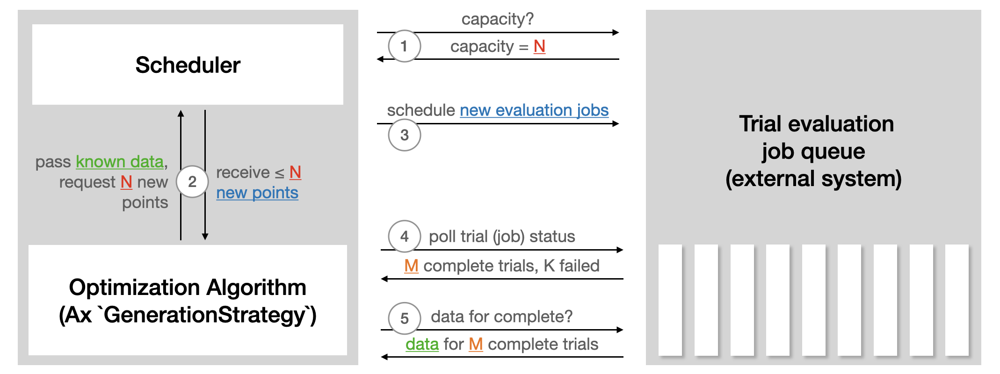

import LinkButtons from "@site/src/components/LinkButtons.jsx";
import CellOutput from "@site/src/components/CellOutput.jsx";
import {PlotlyFigure} from "@site/src/components/Plotting.jsx";

<LinkButtons
  githubUrl="https://github.com/facebook/ax/blob/main/tutorials/automating/automating.ipynb"
  colabUrl="https://colab.research.google.com/github/facebook/ax/blob/main/tutorials/automating/automating.ipynb"
/>

# Automating Orchestration

Previously, we've demonstrated [using Ax for ask-tell optimization](../getting_started),
a paradigm in which we "ask" Ax for candidate configurations and "tell" Ax our
observations. This can be effective in many scenerios, and it can be automated through
use of flow control statements like `for` and `while` loops. However there are some
situations where it would be beneficial to allow Ax to orchestrate the entire
optimization: deploying trials to external systems, polling their status, and reading
reading their results. This can be common in a number of real world engineering tasks,
including:

- **Large scale machine learning experiments** running workloads on high-performance
  computing clusters
- **A/B tests** conducted using an external experimentation platform
- **Materials science** optimizations utilizing a self-driving laboratory

Ax's `Client` can orchestrate automated adaptive experiments like this using its method
`run_trials`. Users create custom classes which implement Ax's `IMetric` and `IRunner`
protocols to handle data fetching and trial deployment respectively. Then, users simply
configure their `Client` as they would normally and call `run_trials`; Ax will deploy
trials, fetch data, generate candidates, and repeat as necessary. Ax can manage complex
orchestration tasks including launching multiple trials in parallel while still
respecting a user-defined concurrency limit, and gracefully handling trial failure by
allowing the experiment to continue even if some trials do not complete successfully or
data fetching fails.

In this tutorial we will optimize the Hartmann6 function as before, but we will
configure custom Runners and Metrics to mimic an external execution system. The Runner
will calculate Hartmann6 with the appropriate parameters, write the result to a file,
and tell Ax the trial is ready after 5 seconds. The Metric will find the appropriate
file and report the results back to Ax.

### Learning Objectives

- Learn when it can be appropriate and/or advantageous to run Ax in a closed-loop
- Configure custom Runners and Metrics, allowing Ax to deploy trials and fetch data
  automatically
- Understand tradeoffs between parallelism and optimization performance

### Prerequisites

- Understanding of [adaptive experimentation](../../intro-to-ae.mdx) and
  [Bayesian optimization](../../intro-to-bo.mdx)
- Familiarity with
  [configuring and conducting experiments in Ax](../getting_started/index.mdx)

## Step 1: Import Necessary Modules

First, ensure you have all the necessary imports:

```python
import os
import time
from typing import Any, Mapping

import numpy as np
from ax.api.client import Client
from ax.api.configs import RangeParameterConfig
from ax.api.protocols.metric import IMetric
from ax.api.protocols.runner import IRunner, TrialStatus
from ax.api.types import TParameterization
```

# Step 2: Defining our custom Runner and Metric

As stated before, we will be creating custom Runner and Metric classes to mimic an
external system. Let's start by defining our Hartmann6 function as before.

```python
# Hartmann6 function
def hartmann6(x1, x2, x3, x4, x5, x6):
    alpha = np.array([1.0, 1.2, 3.0, 3.2])
    A = np.array([
        [10, 3, 17, 3.5, 1.7, 8],
        [0.05, 10, 17, 0.1, 8, 14],
        [3, 3.5, 1.7, 10, 17, 8],
        [17, 8, 0.05, 10, 0.1, 14]
    ])
    P = 10**-4 * np.array([
        [1312, 1696, 5569, 124, 8283, 5886],
        [2329, 4135, 8307, 3736, 1004, 9991],
        [2348, 1451, 3522, 2883, 3047, 6650],
        [4047, 8828, 8732, 5743, 1091, 381]
    ])

    outer = 0.0
    for i in range(4):
        inner = 0.0
        for j, x in enumerate([x1, x2, x3, x4, x5, x6]):
            inner += A[i, j] * (x - P[i, j])**2
        outer += alpha[i] * np.exp(-inner)
    return -outer

hartmann6(0.1, 0.45, 0.8, 0.25, 0.552, 1.0)
```

<CellOutput>
{
`np.float64(-0.4878737485613134)`
}
</CellOutput>

Next, we will define the `MockRunner`. The `MockRunner` requires two methods:
`run_trial` and `poll_trial`.

`run_trial` deploys a trial to the external system with the given parameters. In this
case, we will simply save a file containing the result of a call to the Hartmann6
function.

`poll_trial` queries the external system to see if the trial has completed, failed, or
if it's still running. In this mock example, we will check to see how many seconds have
elapsed since the `run_trial` was called and only report a trial as completed once 5
seconds have elapsed.

Runner's may also optionally implement a `stop_trial` method to terminate a trial's
execution before it has completed. This is necessary for using
[early stopping](../early_stopping) in closed-loop experimentation, but we will skip
this for now.

```python
class MockRunner(IRunner):
    def run_trial(
        self, trial_index: int, parameterization: TParameterization
    ) -> dict[str, Any]:
        file_name = f"{int(time.time())}.txt"

        x1 = parameterization["x1"]
        x2 = parameterization["x2"]
        x3 = parameterization["x3"]
        x4 = parameterization["x4"]
        x5 = parameterization["x5"]
        x6 = parameterization["x6"]

        result = hartmann6(x1, x2, x3, x4, x5, x6)

        with open(file_name, "w") as f:
            f.write(f"{result}")

        return {"file_name": file_name}

    def poll_trial(
        self, trial_index: int, trial_metadata: Mapping[str, Any]
    ) -> TrialStatus:
        file_name = trial_metadata["file_name"]
        time_elapsed = time.time() - int(file_name[:4])

        if time_elapsed < 5:
            return TrialStatus.RUNNING

        return TrialStatus.COMPLETED
```

It's worthwhile to instantiate your Runner and test it is behaving as expected. Let's
deploy a mock trial by manually calling `run_trial` and ensuring it creates a file.

```python
runner = MockRunner()

trial_metadata = runner.run_trial(
    trial_index=-1,
    parameterization={
        "x1": 0.1,
        "x2": 0.45,
        "x3": 0.8,
        "x4": 0.25,
        "x5": 0.552,
        "x6": 1.0,
    },
)

os.path.exists(trial_metadata["file_name"])
```

<CellOutput>
{
`True`
}
</CellOutput>

Now, we will implement the Metric. Metrics only need to implement a `fetch` method,
which returns a progression value (i.e. a step in a timeseries) and an observation
value. Note that the observation can either be a simple float or a (mean, SEM) pair if
the external system can report observed noise.

In this case, we have neither a relevant progression value nor observed noise so we will
simply read the file and report `(0, value)`.

```python
class MockMetric(IMetric):
    def fetch(
        self,
        trial_index: int,
        trial_metadata: Mapping[str, Any],
    ) -> tuple[int, float | tuple[float, float]]:
        file_name = trial_metadata["file_name"]

        with open(file_name, 'r') as file:
            value = float(file.readline())
            return (0, value)
```

Again, let's validate the Metric created above by instantiating it and reporting the
value from the file generated during testing of the Runner.

```python
# Note: all Metrics must have a name. This will become relevant when attaching metrics to the Client
hartmann6_metric = MockMetric(name="hartmann6")

hartmann6_metric.fetch(trial_index=-1, trial_metadata=trial_metadata)
```

<CellOutput>
{
`(0, -0.4878737485613134)`
}
</CellOutput>

## Step 3: Initialize the Client and Configure the Experiment

Finally, we can initialize the `Client` and configure the experiment as before. This
will be familiar to readers of the
[Getting Started with Ax tutorial](../getting_started) -- the only difference is we will
attach the previously defined Runner and Metric by calling `configure_runner` and
`configure_metrics` respectively.

Note that when initializing `hartmann6_metric` we set `name=hartmann6`, matching the
objective we now set in `configure_optimization`. The `configure_metrics` method uses
this name to ensure that data fetched by this Metric is used correctly during the
experiment. Be careful to correctly set the name of the Metric to reflect its use as an
objective or outcome constraint.

```python
client = Client()
# Define six float parameters for the Hartmann6 function
parameters = [
    RangeParameterConfig(name=f"x{i + 1}", parameter_type="float", bounds=(0, 1))
    for i in range(6)
]

client.configure_experiment(
    parameters=parameters,
    # The following arguments are only necessary when saving to the DB
    name="hartmann6_experiment",
    description="Optimization of the Hartmann6 function",
    owner="developer",
)
client.configure_optimization(objective="-hartmann6")
```

```python
client.configure_runner(runner=runner)
client.configure_metrics(metrics=[hartmann6_metric])
```

## Step 5: Run trials

Once the `Client` has been configured, we can begin running trials.

Internally, Ax uses a class named `Scheduler` to orchestrate the trial deployment,
polling, data fetching, and candidate generation.



The `run_trials` method provides users with control over various orchestration settings
as well as the total maximum number of trials to evaluate:

- `parallelism` defines the maximum number of trials that may be run at once. If your
  external system supports multiple evaluations in parallel, increasing this number can
  significantly decrease experimentation time. However, it is important to note that as
  parallelism increases, optimiztion performance often decreases. This is because
  adaptive experimentation methods rely on previously observed data for candidate
  generation -- the more tirals that have been observed prior to generation of a new
  candidate, the more accurate Ax's model will be for generation of that candidate.
- `tolerated_trial_failure_rate` sets the proportion of trials are allowed to fail
  before Ax raises an Exception. Depending on how expensive a single trial is to
  evaluate or how unreliable trials are expected to be, the experimenter may want to be
  notified as soon as a single trial fails or they may not care until more than half the
  trials are failing. Set this value as is appropriate for your context.
- `initial_seconds_between_polls` sets the frequency at which the status of a trial is
  checked and the results are attempted to be fetched. Set this to be low for trials
  that are expected to complete quickly or high for trials the are expected to take a
  long time.

```python
client.run_trials(
    max_trials=30,
    parallelism=3,
    tolerated_trial_failure_rate=0.1,
    initial_seconds_between_polls=1,
)
```

<CellOutput>
{
`[INFO 09-05 18:04:41] ax.api.client: GenerationStrategy(name='Center+Sobol+MBM:fast', nodes=[CenterGenerationNode(next_node_name='Sobol'), GenerationNode(node_name='Sobol', generator_specs=[GeneratorSpec(generator_enum=Sobol, model_key_override=None)], transition_criteria=[MinTrials(transition_to='MBM'), MinTrials(transition_to='MBM')]), GenerationNode(node_name='MBM', generator_specs=[GeneratorSpec(generator_enum=BoTorch, model_key_override=None)], transition_criteria=[])]) chosen based on user input and problem structure.
[INFO 09-05 18:04:41] Orchestrator: Orchestrator requires experiment to have immutable search space and optimization config. Setting property immutable_search_space_and_opt_config to True on experiment.
[INFO 09-05 18:04:41] Orchestrator: Running trials [0]...
[INFO 09-05 18:04:42] Orchestrator: Running trials [1]...
[INFO 09-05 18:04:43] Orchestrator: Running trials [2]...
[INFO 09-05 18:04:44] Orchestrator: Retrieved COMPLETED trials: 0 - 2.
[INFO 09-05 18:04:44] Orchestrator: Running trials [3]...
[INFO 09-05 18:04:45] Orchestrator: Running trials [4]...
[INFO 09-05 18:04:46] Orchestrator: Running trials [5]...
[INFO 09-05 18:04:47] Orchestrator: Retrieved COMPLETED trials: 3 - 5.
[INFO 09-05 18:04:48] Orchestrator: Running trials [6]...
[INFO 09-05 18:04:49] Orchestrator: Running trials [7]...
[INFO 09-05 18:04:51] Orchestrator: Running trials [8]...
[INFO 09-05 18:04:52] Orchestrator: Retrieved COMPLETED trials: 6 - 8.
[INFO 09-05 18:04:52] Orchestrator: Running trials [9]...
[INFO 09-05 18:04:54] Orchestrator: Running trials [10]...
[INFO 09-05 18:04:55] Orchestrator: Running trials [11]...
[INFO 09-05 18:04:56] Orchestrator: Retrieved COMPLETED trials: 9 - 11.
[INFO 09-05 18:04:57] Orchestrator: Running trials [12]...
[INFO 09-05 18:04:59] Orchestrator: Running trials [13]...
[INFO 09-05 18:05:01] Orchestrator: Running trials [14]...
[INFO 09-05 18:05:02] Orchestrator: Retrieved COMPLETED trials: 12 - 14.
[INFO 09-05 18:05:02] Orchestrator: Running trials [15]...
[INFO 09-05 18:05:04] Orchestrator: Running trials [16]...
[INFO 09-05 18:05:06] Orchestrator: Running trials [17]...
[INFO 09-05 18:05:07] Orchestrator: Retrieved COMPLETED trials: 15 - 17.
[INFO 09-05 18:05:08] Orchestrator: Running trials [18]...
[INFO 09-05 18:05:10] Orchestrator: Running trials [19]...
[INFO 09-05 18:05:11] Orchestrator: Running trials [20]...
[INFO 09-05 18:05:12] Orchestrator: Retrieved COMPLETED trials: 18 - 20.
[INFO 09-05 18:05:13] Orchestrator: Running trials [21]...
[INFO 09-05 18:05:15] Orchestrator: Running trials [22]...
[INFO 09-05 18:05:17] Orchestrator: Running trials [23]...
[INFO 09-05 18:05:18] Orchestrator: Retrieved COMPLETED trials: 21 - 23.
[INFO 09-05 18:05:19] Orchestrator: Running trials [24]...
[INFO 09-05 18:05:21] Orchestrator: Running trials [25]...
[INFO 09-05 18:05:23] Orchestrator: Running trials [26]...
[INFO 09-05 18:05:24] Orchestrator: Retrieved COMPLETED trials: 24 - 26.
[INFO 09-05 18:05:25] Orchestrator: Running trials [27]...
[INFO 09-05 18:05:27] Orchestrator: Running trials [28]...
[INFO 09-05 18:05:28] Orchestrator: Running trials [29]...
[INFO 09-05 18:05:29] Orchestrator: Retrieved COMPLETED trials: 27 - 29.`
}
</CellOutput>

## Step 6: Analyze Results

As before, Ax can compute the best parameterization observed and produce a number of
analyses to help interpret the results of the experiment.

It is also worth noting that the experiment can be resumed at any time using Ax's
storage functionality. When configured to use a SQL databse, the `Client` saves a
snapshot of itself at various points throughout the call to `run_trials`, making it
incredibly easy to continue optimization after an unexpected failure. You can learn more
about storage in Ax [here](../../recipes/experiment-to-json).

```python
best_parameters, prediction, index, name = client.get_best_parameterization()
print("Best Parameters:", best_parameters)
print("Prediction (mean, variance):", prediction)
```

<CellOutput>
{
`Best Parameters: {'x1': 0.4209241742907806, 'x2': 1.0, 'x3': 0.8476020434219401, 'x4': 0.5712255048638633, 'x5': 0.0, 'x6': 0.0}
Prediction (mean, variance): {'hartmann6': (np.float64(-2.7746274772453825), np.float64(0.0016136715777291424))}`
}
</CellOutput>

```python
# display=True instructs Ax to sort then render the resulting analyses
cards = client.compute_analyses(display=True)
```

**Modeled Arm Effects on hartmann6**

Modeled effects on hartmann6. This plot visualizes predictions of the true metric
changes for each arm based on Ax's model. This is the expected delta you would expect if
you (re-)ran that arm. This plot helps in anticipating the outcomes and performance of
arms based on the model's predictions. Note, flat predictions across arms indicate that
the model predicts that there is no effect, meaning if you were to re-run the
experiment, the delta you would see would be small and fall within the confidence
interval indicated in the plot.


<PlotlyFigure data={require('./assets/plot_data/bc208341-ecdf-4b98-ae1b-b930f8789936.json')} />


**Observed Arm Effects on hartmann6**

Observed effects on hartmann6. This plot visualizes the effects from previously-run arms
on a specific metric, providing insights into their performance. This plot allows one to
compare and contrast the effectiveness of different arms, highlighting which
configurations have yielded the most favorable outcomes.


<PlotlyFigure data={require('./assets/plot_data/c6081600-302f-443c-988b-0d6a424c8064.json')} />


**Summary for hartmann6_experiment**

High-level summary of the `Trial`-s in this `Experiment`


|    |   trial_index |   arm_name | trial_status   | generation_node     |   hartmann6 |       x1 |       x2 |       x3 |       x4 |       x5 |       x6 |
|---:|--------------:|-----------:|:---------------|:--------------------|------------:|---------:|---------:|---------:|---------:|---------:|---------:|
|  0 |             0 |        0_0 | COMPLETED      | CenterOfSearchSpace |   -0.505315 | 0.5      | 0.5      | 0.5      | 0.5      | 0.5      | 0.5      |
|  1 |             1 |        1_0 | COMPLETED      | Sobol               |   -0.482592 | 0.664811 | 0.252875 | 0.3436   | 0.494184 | 0.454866 | 0.427846 |
|  2 |             2 |        2_0 | COMPLETED      | Sobol               |   -0.032119 | 0.052328 | 0.756081 | 0.530768 | 0.636366 | 0.841635 | 0.946759 |
|  3 |             3 |        3_0 | COMPLETED      | Sobol               |   -0.154924 | 0.490879 | 0.034683 | 0.247156 | 0.01711  | 0.675091 | 0.654221 |
|  4 |             4 |        4_0 | COMPLETED      | Sobol               |   -0.013076 | 0.855443 | 0.538362 | 0.934872 | 0.843922 | 0.061855 | 0.221243 |
|  5 |             5 |        5_0 | COMPLETED      | MBM                 |   -0.912411 | 0.3449   | 0.998121 | 0.457082 | 0.411238 | 0.521881 | 0.283613 |
|  6 |             6 |        6_0 | COMPLETED      | MBM                 |   -0.977328 | 0.189673 | 1        | 0.351755 | 0.473175 | 0.583849 | 0.145826 |
|  7 |             7 |        7_0 | COMPLETED      | MBM                 |   -0.094224 | 0.357708 | 1        | 0.550514 | 0        | 0.493723 | 0.219044 |
|  8 |             8 |        8_0 | COMPLETED      | MBM                 |   -0.225618 | 0.0855   | 1        | 0.097413 | 0.472558 | 0.447244 | 0.278517 |
|  9 |             9 |        9_0 | COMPLETED      | MBM                 |   -1.78085  | 0.263668 | 1        | 0.439009 | 0.470344 | 0.59049  | 0.035284 |
| 10 |            10 |       10_0 | COMPLETED      | MBM                 |   -0.151303 | 0.027308 | 1        | 0.403539 | 0.422969 | 0.815619 | 0.187611 |
| 11 |            11 |       11_0 | COMPLETED      | MBM                 |   -0.168788 | 0.00702  | 1        | 0.413484 | 0.46721  | 0.306258 | 0.139212 |
| 12 |            12 |       12_0 | COMPLETED      | MBM                 |   -2.23398  | 0.321843 | 0.998488 | 0.485139 | 0.481557 | 0.590527 | 0        |
| 13 |            13 |       13_0 | COMPLETED      | MBM                 |   -1.83735  | 0.306801 | 0.727054 | 0.433236 | 0.442676 | 0.383518 | 0        |
| 14 |            14 |       14_0 | COMPLETED      | MBM                 |   -2.03301  | 0.30383  | 1        | 0.776427 | 0.489945 | 1        | 0        |
| 15 |            15 |       15_0 | COMPLETED      | MBM                 |   -2.67971  | 0.424332 | 1        | 0.214058 | 0.585847 | 0.533866 | 0        |
| 16 |            16 |       16_0 | COMPLETED      | MBM                 |   -2.79355  | 0.420924 | 1        | 0.847602 | 0.571226 | 0        | 0        |
| 17 |            17 |       17_0 | COMPLETED      | MBM                 |   -2.36548  | 0.431674 | 1        | 0        | 0.509416 | 1        | 0        |
| 18 |            18 |       18_0 | COMPLETED      | MBM                 |   -1.72219  | 0.419512 | 1        | 0.93052  | 0.794368 | 0        | 0        |
| 19 |            19 |       19_0 | COMPLETED      | MBM                 |   -2.07486  | 0.428771 | 1        | 0        | 0.733658 | 0        | 0        |
| 20 |            20 |       20_0 | COMPLETED      | MBM                 |   -0.453951 | 0.382312 | 1        | 1        | 1        | 0        | 0        |
| 21 |            21 |       21_0 | COMPLETED      | MBM                 |   -2.50371  | 0.484404 | 1        | 1        | 0.551285 | 0        | 0        |
| 22 |            22 |       22_0 | COMPLETED      | MBM                 |   -2.71904  | 0.446673 | 1        | 1        | 0.574038 | 0.263177 | 0        |
| 23 |            23 |       23_0 | COMPLETED      | MBM                 |   -1.32978  | 0.462335 | 0.566813 | 1        | 0.587879 | 0        | 0        |
| 24 |            24 |       24_0 | COMPLETED      | MBM                 |   -0.011518 | 0.011794 | 0.081845 | 0        | 0.186207 | 0        | 0        |
| 25 |            25 |       25_0 | COMPLETED      | MBM                 |   -0.000226 | 1        | 0        | 1        | 0.375771 | 1        | 1        |
| 26 |            26 |       26_0 | COMPLETED      | MBM                 |   -9e-06    | 0.546011 | 0        | 0        | 0.990969 | 1        | 1        |
| 27 |            27 |       27_0 | COMPLETED      | MBM                 |   -0.001111 | 1        | 0.223871 | 0        | 0.004798 | 0        | 0        |
| 28 |            28 |       28_0 | COMPLETED      | MBM                 |   -2.2e-05  | 1        | 0        | 0.702698 | 0        | 1        | 0        |
| 29 |            29 |       29_0 | COMPLETED      | MBM                 |   -0.000111 | 0        | 0        | 1        | 1        | 1        | 0        |


**Sensitivity Analysis for hartmann6**

Understand how each parameter affects hartmann6 according to a second-order sensitivity
analysis.


<PlotlyFigure data={require('./assets/plot_data/b8e8b3e9-9046-480b-9e96-bbb6e0274ef8.json')} />


**x6 vs. hartmann6**

The slice plot provides a one-dimensional view of predicted outcomes for hartmann6 as a
function of a single parameter, while keeping all other parameters fixed at their
status_quo value (or mean value if status_quo is unavailable). This visualization helps
in understanding the sensitivity and impact of changes in the selected parameter on the
predicted metric outcomes.


<PlotlyFigure data={require('./assets/plot_data/ced63dfe-14b8-4d68-99ce-18f0b1903b3c.json')} />


**x1 vs. hartmann6**

The slice plot provides a one-dimensional view of predicted outcomes for hartmann6 as a
function of a single parameter, while keeping all other parameters fixed at their
status_quo value (or mean value if status_quo is unavailable). This visualization helps
in understanding the sensitivity and impact of changes in the selected parameter on the
predicted metric outcomes.


<PlotlyFigure data={require('./assets/plot_data/f4f58ffd-36bc-4e76-be9f-526b6c0635a1.json')} />


**x1, x6 vs. hartmann6**

The contour plot visualizes the predicted outcomes for hartmann6 across a
two-dimensional parameter space, with other parameters held fixed at their status_quo
value (or mean value if status_quo is unavailable). This plot helps in identifying
regions of optimal performance and understanding how changes in the selected parameters
influence the predicted outcomes. Contour lines represent levels of constant predicted
values, providing insights into the gradient and potential optima within the parameter
space.


<PlotlyFigure data={require('./assets/plot_data/028ebd52-9334-4bbc-96bf-639b12db09c9.json')} />


**Cross Validation for hartmann6**

The cross-validation plot displays the model fit for each metric in the experiment. It
employs a leave-one-out approach, where the model is trained on all data except one
sample, which is used for validation. The plot shows the predicted outcome for the
validation set on the y-axis against its actual value on the x-axis. Points that align
closely with the dotted diagonal line indicate a strong model fit, signifying accurate
predictions. Additionally, the plot includes 95% confidence intervals that provide
insight into the noise in observations and the uncertainty in model predictions. A
horizontal, flat line of predictions indicates that the model has not picked up on
sufficient signal in the data, and instead is just predicting the mean.


<PlotlyFigure data={require('./assets/plot_data/abd71da6-3a49-423f-a866-2d3589ae5c29.json')} />

## Conclusion

This tutorial demonstrates how to use Ax's `Client` for closed-loop optimization using
the Hartmann6 function as an example. This style of optimization is useful in scenarios
where trials are evaluated on some external system or when experimenters wish to take
advantage of parallel evaluation, trial failure handling, or simply to manage
long-running optimization tasks without human intervention. You can define your own
Runner and Metric classes to communicate with whatever external systems you wish to
interface with, and control optimization using the `OrchestrationConfig`.

